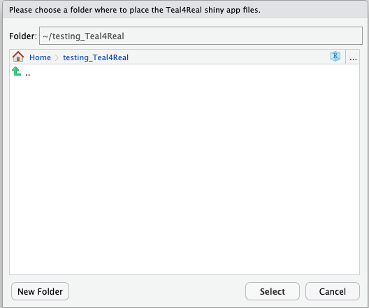
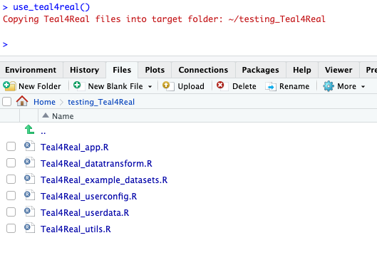
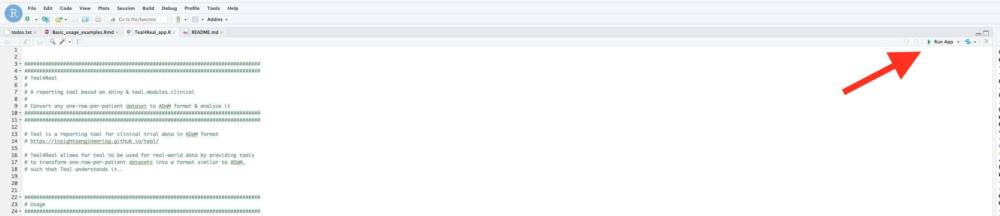

```{r, include = FALSE}
knitr::opts_chunk$set(
  collapse = TRUE,
  comment = "#>"
)
```


## Getting the first demo app to run


To get started, install the `Teal4Real` package and dependencies as described [here](../index.html). 
This vignette assumes you are using RStudio. However, this is not a requirement for using Teal4Real.


Let's load the package and use the only function in the package called `use_teal4real()`.

A dialog will pop up and you will be asked to choose a folder where the app files should be copied to. 

```
library(Teal4Real)

use_teal4real()
```

Let's create an empty folder and copy the shiny app files there.


</br>
</br>

{#id .class width=70% height=50% padding=30px}

</br>
</br>


You should now see the following files in your app folder:

</br>
</br>

{#id .class width=95% height=95% padding=50px}

</br>
</br>


Open `Teal4Real_app.R` in the RStudio editor, and click `Run app` (top right)


</br>
</br>

{#id .class width=95% height=95% padding=50px}

</br>
</br>


>The result should be a demo app like [this one](https://bretscher-biometrics.shinyapps.io/teal4real-demo/)


## Step two: adapting the app to run on a different dataset

The example above used a dataset adapted from the `survival` R package. 

If you want to use Teal4Real on your own analysis dataset, you'll have to look through all the files with "user" 
in the filename (`Teal4Real_userconfig.R` and `Teal4Real_userdata.R`), and read the explanations in the comments.

You'll have to provide a function that returns your dataset, plus a number of configurations that tell the app e.g. which variables are time-to-event 
endpoints, etc.


